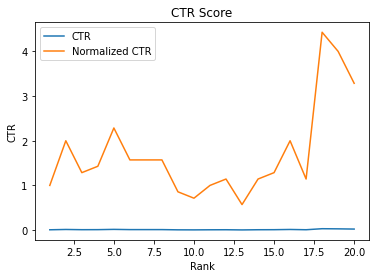

# Google Visibility Score

Are you looking to check your visibility score for your website? Today is your lucky day, with this script you will be able to calculate your own visibility score by only using your Google search console data and your own own list of keywords created by you. No need to have an expensive rank tracking tool or any other paid SEO tool. 


#### What is Visibility Score?

Is a metric that tell us how visible our site is on Search Engines based on a specific set of Keywords. We define Visibility score as a percentage of total search volume we can capture for SEO out of all possible search volumes of a set of keyword.

#### How is it calculated?

Visibility Score is calculated by adding up the total search volume of a keyword set and then checking how well we are ranking for each one of those keyword using our Google search console data. After that we calculate the search volume we should get based on our CTR model. 

Once we have the added up search volume of all keywords we actually rank, we use the current expected total search volume (amount of volume from keywords we are actually ranking) Divided by Max possible Search Volume.


#### What does Visbility score tell us?

Is an indicator that will tell us how visible our site is within a set of keywords. The more keywords we rank in the 1 position the higher the Visibility score will be. This metric is also excelent to measure Algorithm impacts or track changes you do on your site. Its higly correlated to your organic clicks.

## Requirements

1. **Requirements.txt** includes all the libraries we need to use for this to run.

```bash
pip3 install -r requirements.txt
```

2. **Keywords.xlsx**: This file lives on the `/keywords` folder and here you will add your desired keyword set that you want to rank for and the search volume. For search volume you can use Keyword planner or any tool that can give you volume by keyword.

The file should look like: 

| Keywords             | Search Volume |
|----------------------|---------------|
| Kw1                  | 10            |
| Kw2                  | 100           | 
| Kw3                  | 1000          | 


## Usage
To use this script and get your own visibility socre, there are 3 important steps we must follow:

1. **Get Api Keys**:  In order to get our Search console data we need to make sure we have our API Keys saved on the `/google-visibilty-score/api_keys` folder under the name `client_secrets.json`

To get they key please follow this [link](https://developers.google.com/webmaster-tools/search-console-api/v1/configure).

2. **Run oauth.py**: The next step is to authorize and get the `authorizedcreds.dat` file. To do this we should go to `/google-visibilty-score/scripts` and run the oatuh.py file. 

**Note**:  Make sure to stay in the `/script` folder to run everything since I added relative path. If they dont work you can chage all paths to where your files are saved.

```bash
python oauth.py
````
This will open your browser and will ask you to select the email associated with the site we want to get data from. Once you validate this, the script should print Auth succesfull and a list of all the sites you have access on the Google Search console.

- E.g:

```
Authentication successful.
Auth Successful
http://www.intersatelital.com.bo/
http://www.uselessthingstobuy.com/
https://www.tuves.cl/
http://www.uselesswebstuff.com/
https://www.californiadumbbells.com/
https://www.intersatelital.com.bo/monitoreo/
http://www.keiphone.com/
http://www.newbooksinfilm.com/
https://www.uselessthingstobuy.com/
http://www.tuves.cl/
https://simpletools.io/
http://www.tuves.com/
https://www.kburchardt.com/
https://www.komahats.com/
https://www.tuves.net/
https://www.keiphone.com/
http://kburchardt.com/
https://www.simpletools.io/
https://www.intersatelital.com.bo/
https://www.tuves.com/
https://www.nicolas-cage.org/
``` 
Once everything is ready, we should have the file `authorizedcreds.dat` with our credentials saved in `/google-visibilty-score/scripts`


3. **Update fields in rankscore.py**:Once all of our credentials are ready and stored on `/api-key` then we can go to go to the folder `/scripts` and open `rankscore.py`. Here in line 83 we can see all the inputs that we need to update.

	- site: Here we can select any URL we want from the list of GSC properties.
	- Daily dates: Dates that work for the daily files. `start` will be the date you want to start checking your Visbility score. `end` will be until which date you will check your visibility score. The rcommendation is to do no more than 3 months unless you have a lot of time. The process of checking the visiblity score might take too long if its longer than 3 months.
	- Yearly dates: This is ready to go. There is nothing to change here. We will count last 12 months starting today. This file is to generate the CTR table we will use to model our visibility scores.
	- device: mobile or desktop


```python
# =============================================================================
# Inputs that can be changed.
# =============================================================================

#Site: Here we can select any URL we want from the list of GSC properties.
site = "https://www.uselessthingstobuy.com"

#Daily dates:
#daily dates we want to calculate our visibility score. Limit is 16 months.
start = datetime.date(2022, 1, 1)
end = datetime.date(2022, 3, 30)

#Yearly Dates this will count last 12 months starting today. Limit is 16 months:
yearly_start = date.today() - relativedelta(months=+12)
yearly_end = date.today() 

#Device: Here we can select the device we want to get our data. Desktop, Mobile or Table
device = "mobile"
```

4. **run Rankscore.py**: After we have updated our files, we will be able to run rankscore.py. Depending on the amount of files you have this might take some time to create all the graphs. So sea tight and wait a little bit.

If we want to run every task separately you can go to the bottom of the file and run each task separatedly. Make sure you run the functions so that they are created.

```python
#getting Daily data
get_data(start,end,device,"daily")

#getting Yearly data
get_data(yearly_start,yearly_end,device,"yearly")

#load yearly data to create dataframe

df = os.path.abspath("/yearly.xlsx")

df = pd.read_excel('../data/year-data/yearly.xlsx')

#creating and Getting visibily score Visibility score function is inside CTR table
ctr_table(df)
```

## Results

Once you run everything correctly, then you should get the following results:

1. **yearly-data**: Excel spreadsheet with yearly data. This will be used to get our CTR table
2. **day-data**: Multiple excell spreadsheets with that specific date data.
3. **ctr-table**: Excel spread sheet with your CTR table that is calculated from a year. And a PNG image with your CTR table plot.



4. **visibility-score**: Excel spreadsheet with our visibility scores. Also a PNG image with our visibility score plot. ( I need to clean those dates. If anybody know let me know :D )


I have added an example folder with how the data should look like.

## Contributing
Pull requests are welcome. For major changes, please open an issue first to discuss what you would like to change.

If there are any issues, please let me know --> hello@kburchardt.com

## License
[MIT](https://choosealicense.com/licenses/mit/)
